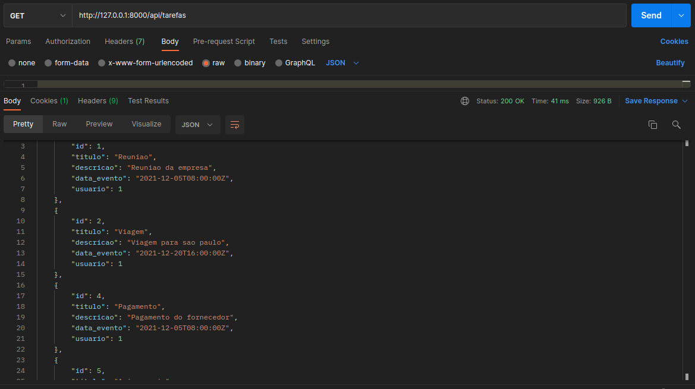
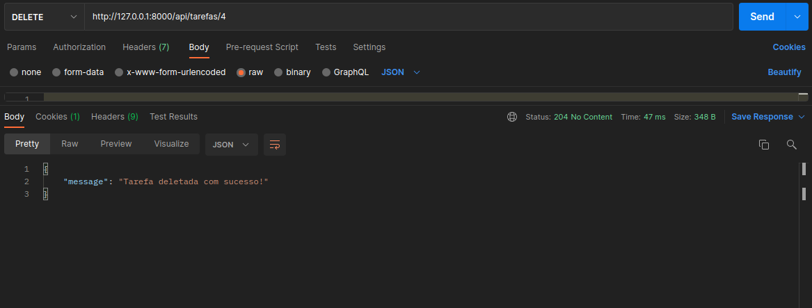

# API Lista de Tarefas
API desenvolvida com o propositor de Agenda utilizando [Django Rest](https://www.django-rest-framework.org/) que permite ao usuário inserir, consultar e deletar tarefas que são armazenadas em um banco de dados [MySQL](https://www.mysql.com/).

## Tecnologia requerida

- Python 3.7
- Django 2.1.15
- Django Rest Framework 3.11.0
- PyMySQL 0.9.3
- django-cors-headers 3.2.1

Usando o [Postman](https://www.postman.com/), para testar as APIs. Todas as ações realizadas são salvas no banco de dados MySQL.

### Metodo POST
- Cria uma nova tarefa usando POST

	

### Metodo GET
- Recupere todas as tarefas usando GET

	

- Recupere uma única tarefa por id usando GET

	

### Metodo PUT
- Atualizar uma tarefa usando PUT

	

### Metodo DELETE
- Excluir uma tarefa usando DELETE

	

